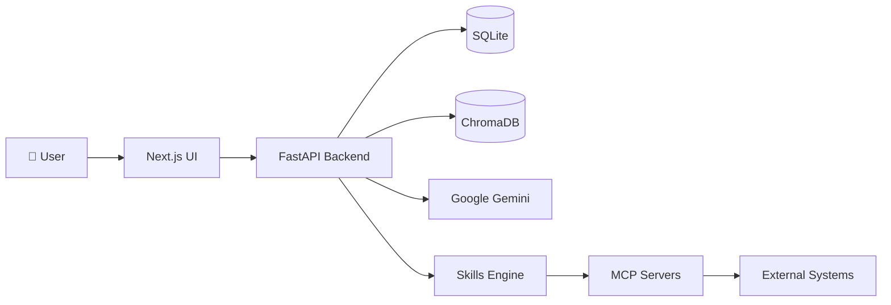

# Knowledge Buddy - Presentation Deck

---

## Slide 1: Title Slide

# Knowledge Buddy 🧠
**AI-Powered Knowledge Management Agent**

*Bridging Generative AI and Agentic AI*

---

## Slide 2: The Problem

### Organizations Face Critical Knowledge Challenges

- **Repetitive Support Queries** - Experts waste time answering the same questions
- **Slow Onboarding** - New employees struggle to find information
- **Information Loss** - Knowledge disappears when employees leave
- **Inefficiency** - Hours wasted searching for documents

> **Result**: Lost productivity, increased costs, frustrated employees

---

## Slide 3: Our Objective

### Create an Intelligent, Autonomous AI Agent

✅ **Centralize** organizational knowledge  
✅ **Provide** instant, accurate answers  
✅ **Learn** and adapt through feedback loops  
✅ **Execute** tasks autonomously via Skills  

---

## Slide 4: The Solution - Two AI Layers

### 🧠 Generative AI Layer (Knowledge)
- RAG-based Q&A system
- Vector search for context retrieval
- Knowledge Gap detection & auto-learning

### ⚡ Agentic AI Layer (Action)
- Python-based Skills execution
- MCP Server integration
- Autonomous task automation

---

## Slide 5: Generative AI vs Agentic AI

| Aspect | Generative AI | Agentic AI |
|--------|---------------|------------|
| **Function** | Answer questions | Execute tasks |
| **User Says** | "What is X?" | "Do X for me" |
| **Example** | "Explain refund policy" | "Process this refund" |
| **Technology** | RAG + LLM | Skills + MCP Servers |
| **Value** | Information retrieval | Task automation |

> **Generative AI** finds information. **Agentic AI** acts on it.

---

## Slide 6: Agentic AI Capabilities

### Skills System
- Custom Python code execution
- Intelligent tool calling by LLM
- Sandboxed, secure environment

### MCP Server Integration
- Connect to databases, APIs, file systems
- Chain multi-step workflows
- Eliminate repetitive tasks

---

## Slide 7: Real-World Examples

### What Agentic AI Can Do:

1. **"Check all production servers and alert if any are down"**
2. **"Pull Q4 sales data, analyze trends, generate report"**
3. **"Monitor Slack channel and summarize key decisions weekly"**
4. **"Process expense reports and update accounting system"**

---

## Slide 8: Architecture

**Tech Stack**: FastAPI • Next.js • ChromaDB • Google Gemini • SQLite

---

## Slide 9: Key Features

### 🎯 Core Capabilities

- **Custom AI Agents** - Create specialized agents for different domains
- **Apprentice Mode** - Train agents with PDFs, documents, text
- **Smart Q&A** - Context-aware answers with conversation history
- **Knowledge Gaps** - Auto-detect missing information
- **Skills Library** - Extensible action framework
- **MCP Integration** - Connect to any external system

---

## Slide 10: Business Impact - Cost Savings

### 💰 Quantifiable Benefits

| Metric | Impact |
|--------|--------|
| **Support Ticket Reduction** | 30-50% decrease |
| **Time Saved per Employee** | 5-10 hours/week |
| **Onboarding Time** | 40% faster |
| **Availability** | 24/7 (vs business hours) |

---

## Slide 11: Business Impact - Operational Excellence

### 🚀 Strategic Advantages

**Efficiency**
- Autonomous multi-step workflows
- Instant access to knowledge
- Zero wait time for answers

**Quality**
- Standardized, consistent responses
- Reduced human error in repetitive tasks
- Continuous learning from gaps

---

## Slide 12: Competitive Advantage

### Why Knowledge Buddy Stands Out

❌ **Traditional Chatbots**: Static FAQs, no learning  
❌ **Basic RAG Systems**: Only answer questions  
✅ **Knowledge Buddy**: Learns + Acts autonomously  

### The Difference:
- **Generative AI** reduces time to *find* information
- **Agentic AI** eliminates time to *act* on information

---

## Slide 13: Implementation Roadmap

### Phase 1: Foundation (Week 1-2)
- Deploy backend + frontend
- Create first agent
- Upload initial knowledge base

### Phase 2: Training (Week 3-4)
- Train agents with domain-specific docs
- Collect feedback, close knowledge gaps

### Phase 3: Automation (Week 5+)
- Add Skills for common tasks
- Integrate MCP servers
- Measure ROI

---

## Slide 14: Call to Action

### Ready to Transform Your Knowledge Management?

**Next Steps:**
1. Pilot with one department (2-4 weeks)
2. Measure support ticket reduction
3. Scale across organization

**Contact**: [Your Contact Info]

---

## Slide 15: Q&A

# Questions?

**Thank you!**
